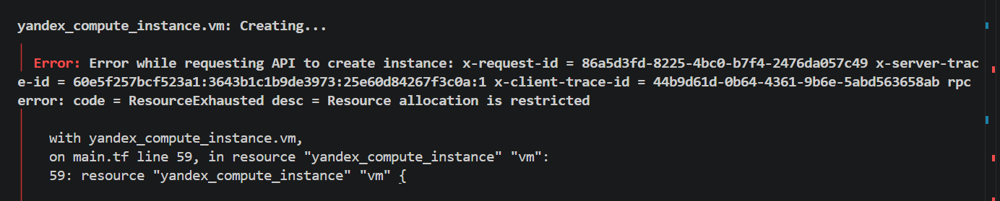

# architecture-future_2_0
YA PR sprint 11

task 1
диаграмма в файле c4.puml
обоснование в task1.md

task 2
диаграмма в task2.xml
обоснование в task2.md

task 3
радар на картинке radar.jpg (исходный код в соответствующем xml)
роадмэп на картинке roadmap.jpg (исходный код в соответствующем xml)
обоснование и приоритеты в task3.md

task 4

диаграмма на картинке Depl.jpg
конфиг terraform в файла main.tf, outputs.tf, terraform.tfvars, variables.tf

когда запускал - видимо датацентры яндекса были не доступны, поэтому получал все время ошибку невозможности аллоцировать ресурсы; terraform validate и terraform plan успешно запускались

в файле terraform.tfvars стерто значение облака, папки и токена. Также из проекта удален yandex-provider, т.к. файл слишком больше, гит просто так не поддерживает

